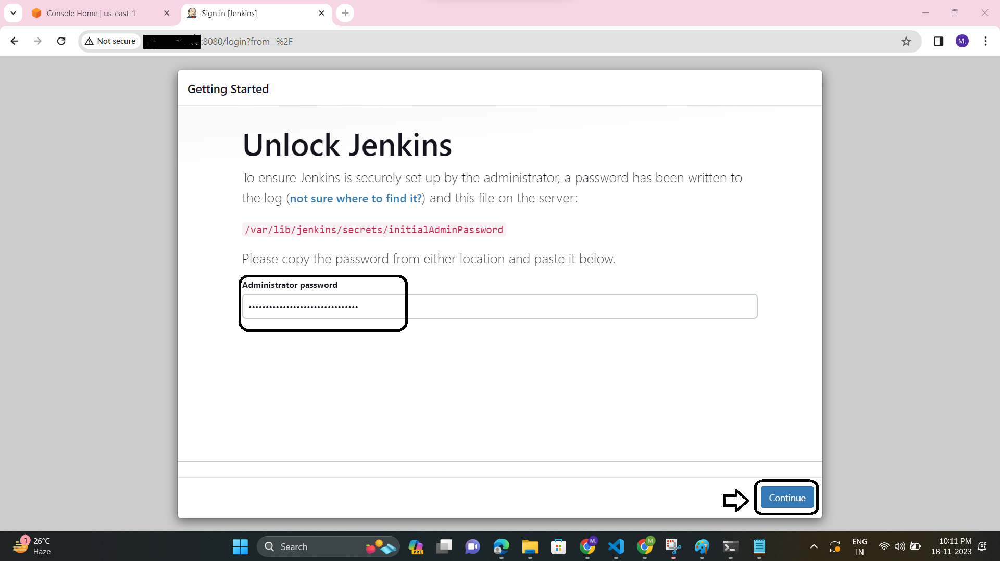
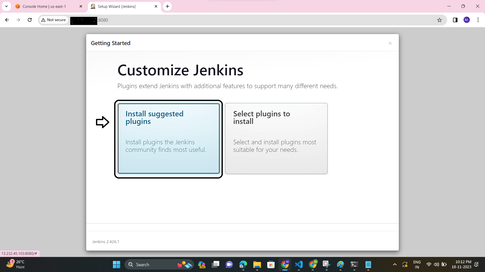
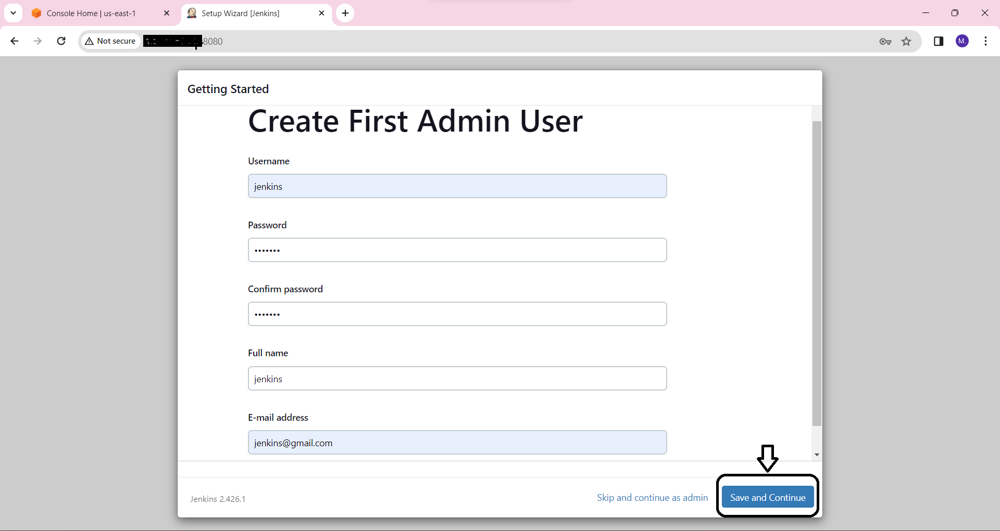
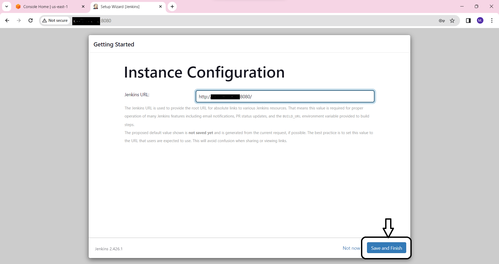
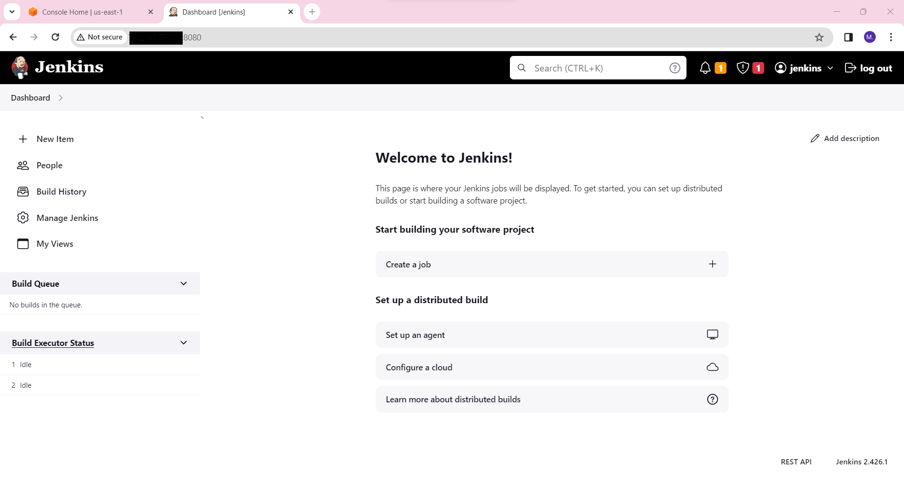

# What is Jenkins?

Jenkins is an open-source automation tool written in Java. It is used to automate the CI/CD process.

# Jenkins Installation

    Install Java
    Install Libraries
    Install Jenkins

# Launch EC2 server and install docker on it

# Java Download
https://www.oracle.com/in/java/technologies/downloads/

```Copy
wget https://download.oracle.com/java/24/latest/jdk-24_linux-x64_bin.rpm
```

```Copy
yum install <jdk_package>
```

# Install jenkins
https://github.com/jenkinsci/docker/blob/master/README.md

```Copy
docker run -d -v jenkins_home:/var/jenkins_home -p 8080:8080 -p 50000:50000 --restart=on-failure jenkins/jenkins:lts-jdk17
```

# Now Jenkins is installed and running on port 8080. To access Jenkins, open the following URL in a browser:

```Copy
http://<ec2-instance-public-ip>:8080
```

To get the initial admin password, run the following command:

```Copy
docker exec <jenkins_container_id_or_name> cat /var/jenkins_home/secrets/initialAdminPassword
```


Install the suggested plugins.


Create an admin user. 



Jenkins is now ready to use. 


