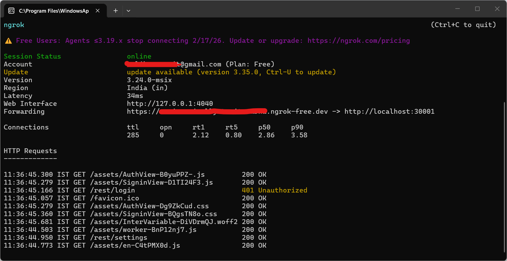
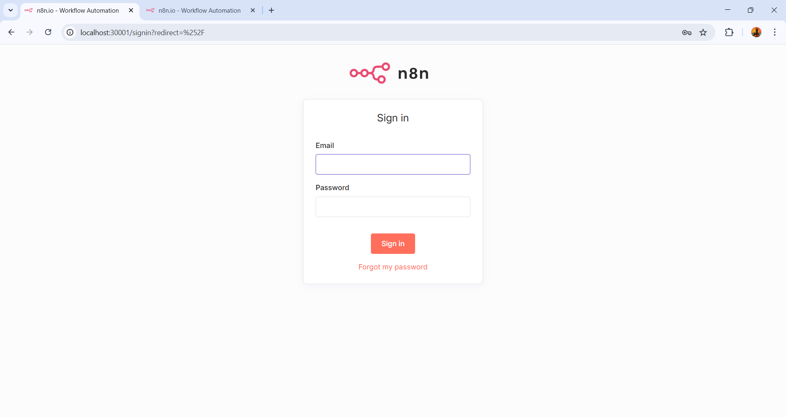
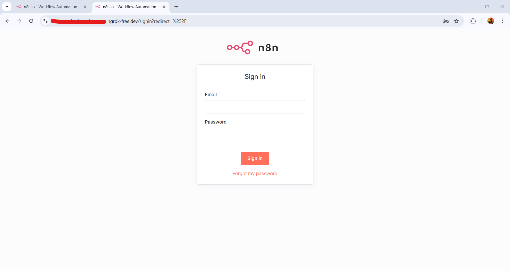
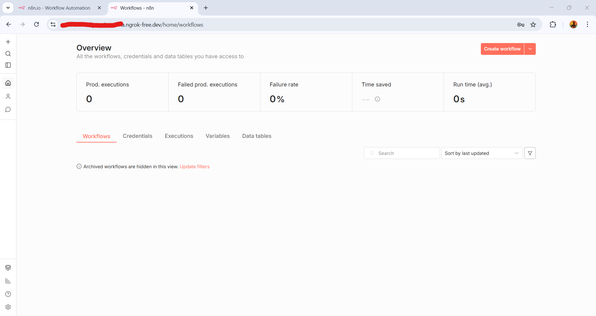

# n8n on Local Kubernetes (Docker Desktop) with ngrok Tunneling

This project provides a Kubernetes manifest to run **n8n** locally using **Docker Desktop**. It is pre-configured for **persistence** and includes instructions for using **ngrok** to expose local webhooks to the internet (essential for Telegram/WhatsApp bots).

## Getting Started

### Prerequisites

* **Docker Desktop** with **Kubernetes** enabled.
* **kubectl** installed.
* **ngrok** account and CLI installed.

### 1. Start the ngrok Tunnel

Telegram and other services cannot "see" your localhost. You must create a public tunnel first:

```bash
ngrok http 30001

```

*Note: We use port 30001 because that is the NodePort defined in our Kubernetes service.*

**Copy the HTTPS URL** provided by ngrok (e.g., `https://your-unique-id.ngrok-free.app`).

### 2. Configure the Manifest

Open `n8n-local.yaml` and update the `WEBHOOK_URL` environment variable with your ngrok URL:

```yaml
- name: WEBHOOK_URL
  value: "https://your-unique-id.ngrok-free.app/"

```

### 3. Deploy to Kubernetes

```bash
kubectl apply -f n8n-local.yaml

```

---

## Management Commands

### Stop n8n (Pause)

```bash
kubectl scale deployment n8n --replicas=0 -n n8n

```

### Start/Resume n8n

```bash
kubectl scale deployment n8n --replicas=1 -n n8n

```

### Apply Configuration Changes

If you change the `WEBHOOK_URL` in your YAML, run:

```bash
kubectl apply -f n8n-local.yaml
kubectl rollout restart deployment n8n -n n8n

```

---

## Architecture & Persistence

* **Namespace**: `n8n` (Isolation).
* **PersistentVolumeClaim**: Saves workflows and credentials in `/home/node/.n8n`.
* **Service**: Exposed via **NodePort 30001**.
* **Environment Variables**:
* `N8N_PROTOCOL`: set to `https` for tunnel compatibility.
* `WEBHOOK_URL`: Required for external services to send data back to your local instance.

---

### Sample Output:

* **ngrok Screen:**



* **n8n Screen:**







---