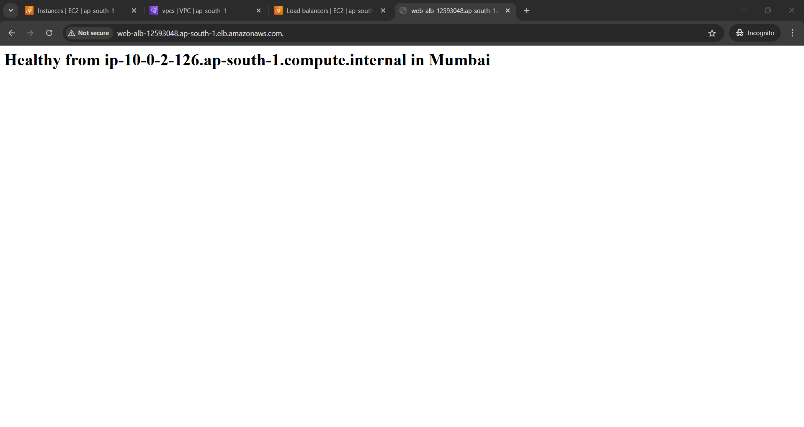
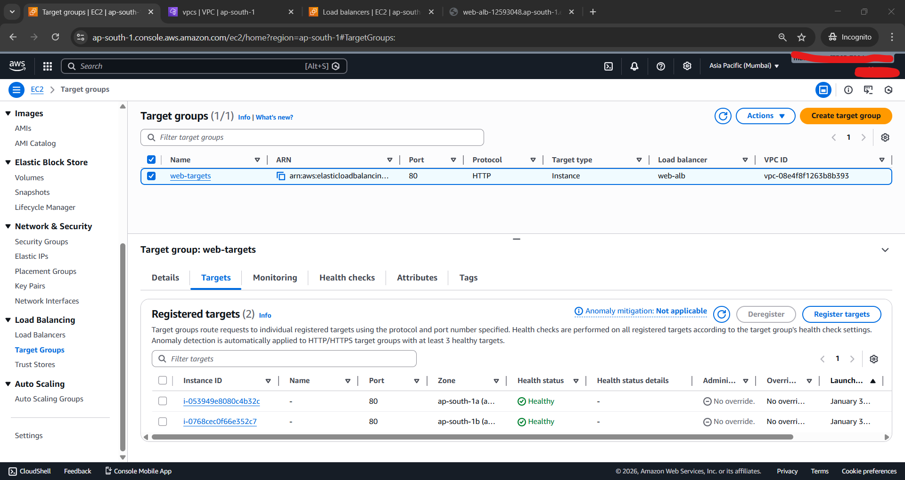
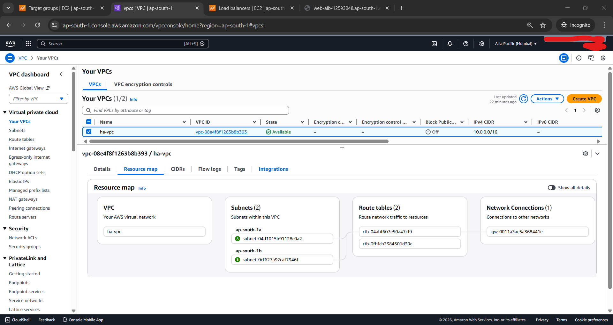

## Highly Available & Scalable Web Infrastructure

**Goal:** Deploy a resilient web application that automatically scales based on traffic and ensures zero downtime across multiple Availability Zones.

* **Tech Stack:** Terraform (IaC), AWS VPC, ALB, Auto Scaling Group (ASG), EC2.

* **Key Features:**
* **Network Isolation:** Provisioned a custom VPC with public subnets for the Load Balancer and private-facing logic.

* **Fault Tolerance:** Distributed EC2 instances across `ap-south-1a` and `ap-south-1b` (Mumbai).

* **Security:** Implemented Security Group nesting where EC2 instances only accept traffic originating from the ALB.

* **Deployment:**
```bash
cd project7-ha-infra
terraform init
terraform apply

```

---

### Sample Output:

* **The "Healthy" Load Balancer:**




* **EC2 Instance Dashboard:**


* **Target Group Health Check:**



* **VPC Resource Map:**



---