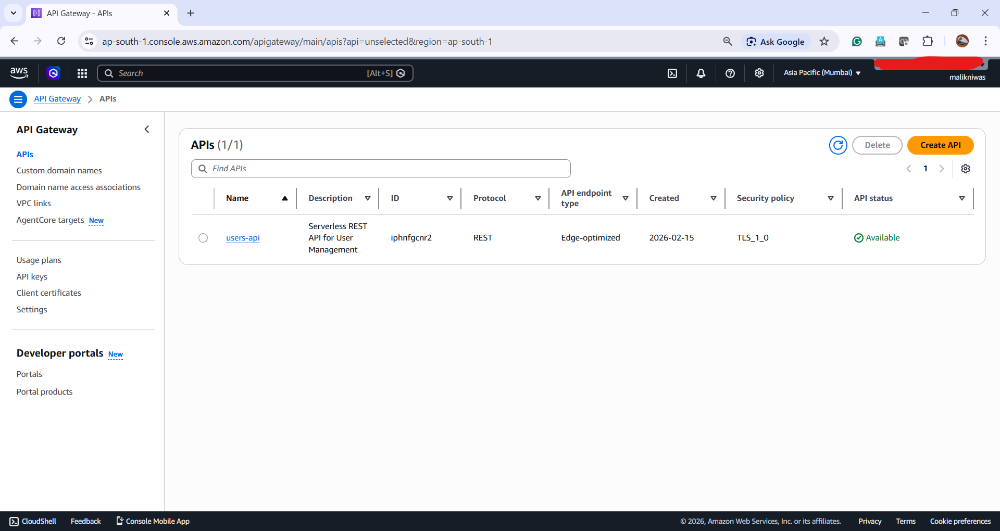
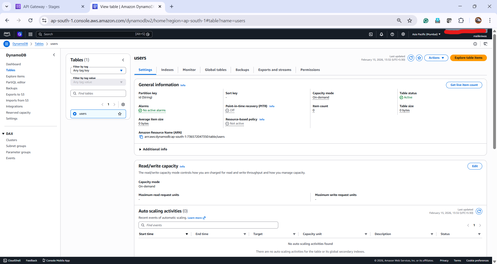
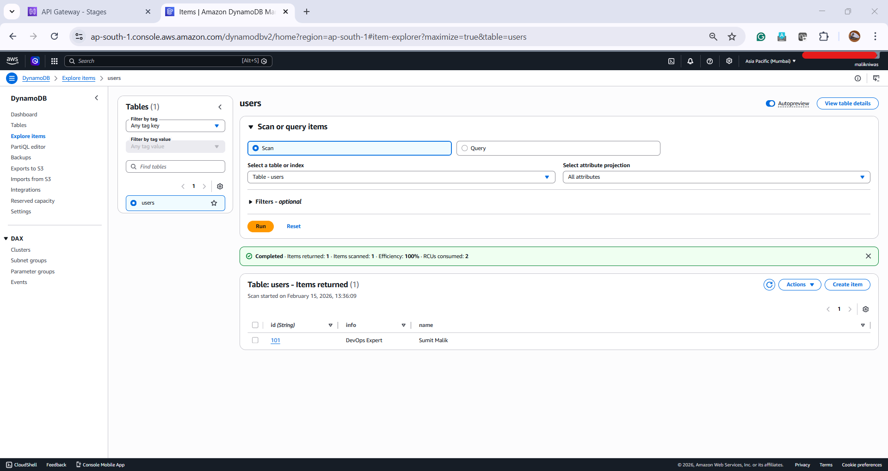
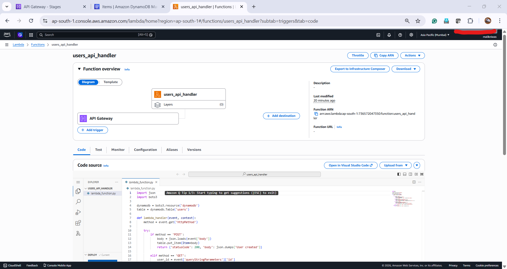
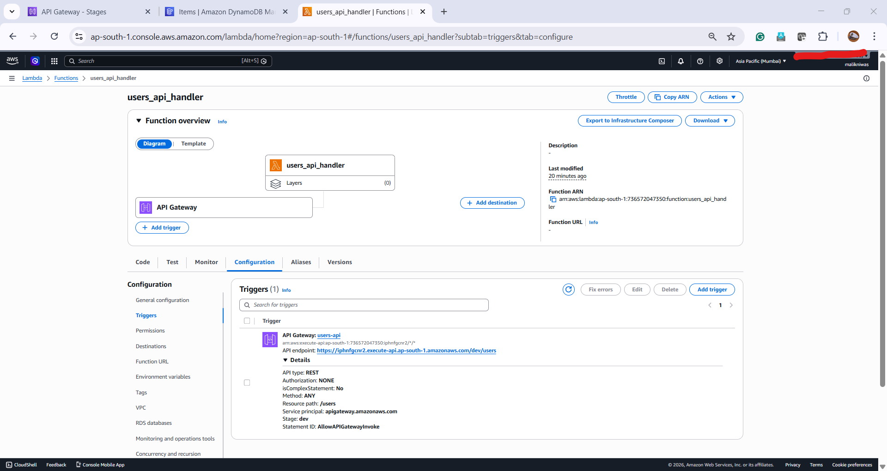
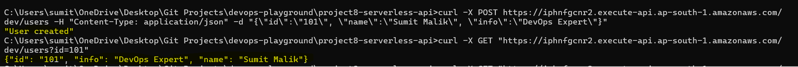
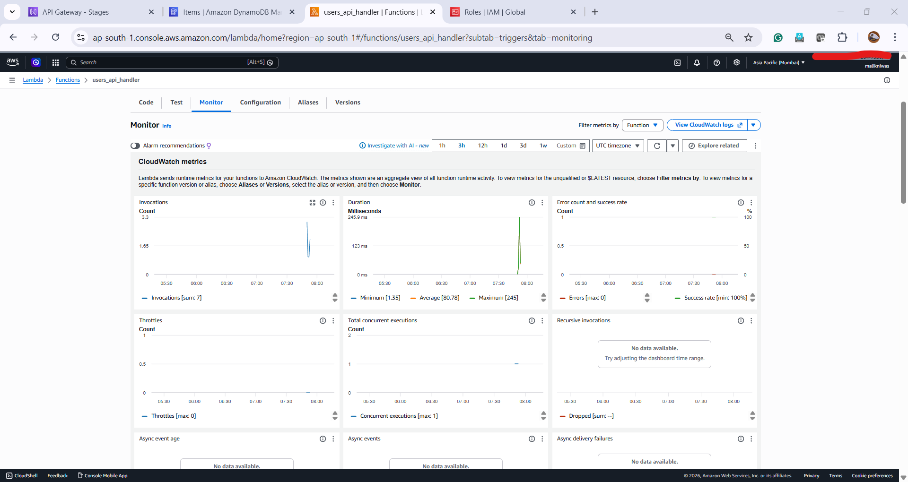

## Serverless REST API for User Management

**Goal:** Build a cost-efficient, event-driven API performing full CRUD operations without managing underlying servers.

* **Tech Stack:** AWS Lambda (Python), API Gateway, DynamoDB.

* **Key Features:**
* **On-Demand Scaling:** Utilized DynamoDB with PAY_PER_REQUEST billing for zero-cost idle time.

* **Security:** Enforced IAM execution roles with the Principle of Least Privilege for Lambda-to-DynamoDB access.

* **Logic:** Developed a single-entry Python handler to process `GET`, `POST`, `PUT`, and `DELETE` requests.

* **API Testing:**
```bash
curl -X POST <api_url>/users -d '{"id":"123", "name":"Sumit Malik"}'

```

---

## Prerequisites

* AWS CLI configured with appropriate IAM permissions.

* Terraform installed.

* Basic understanding of Python for Lambda logic.

---

### Sample Output:

* **API Gateway Endpoint & Stage (The Entry Point):**




* **DynamoDB Table "Explore Items" (The Data Layer):**




* **Lambda Function Configuration (The Logic):**




* **Successful cURL Response (The Validation):**



* **CloudWatch Metrics / Logs (The Observability):**



---