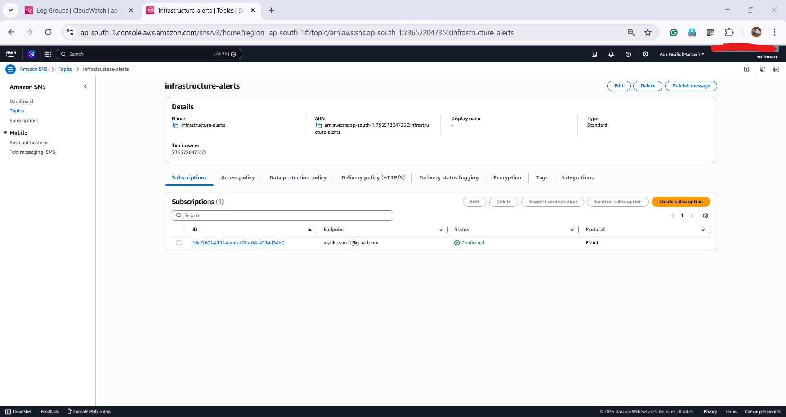
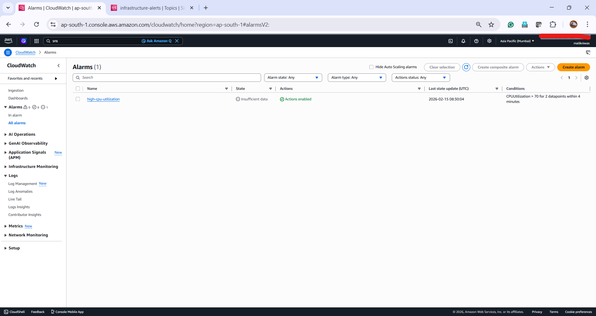
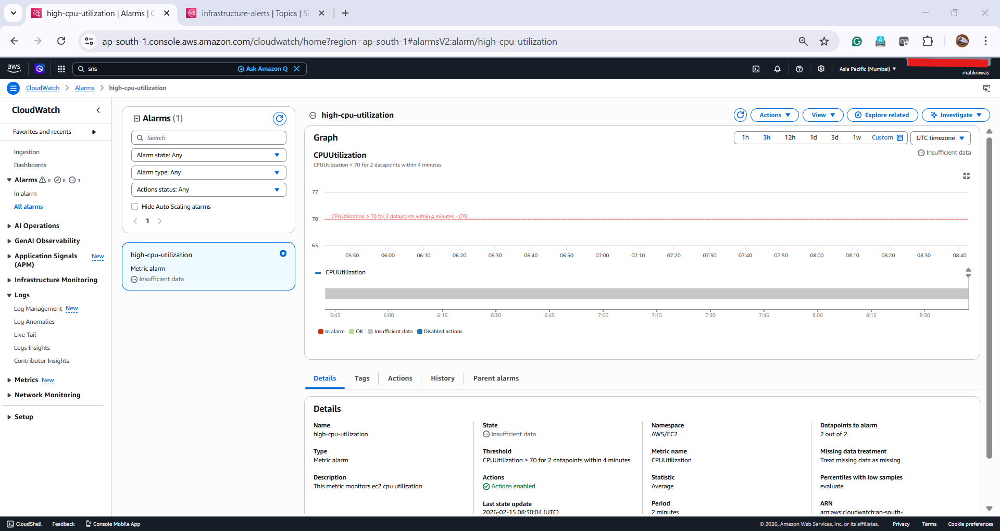
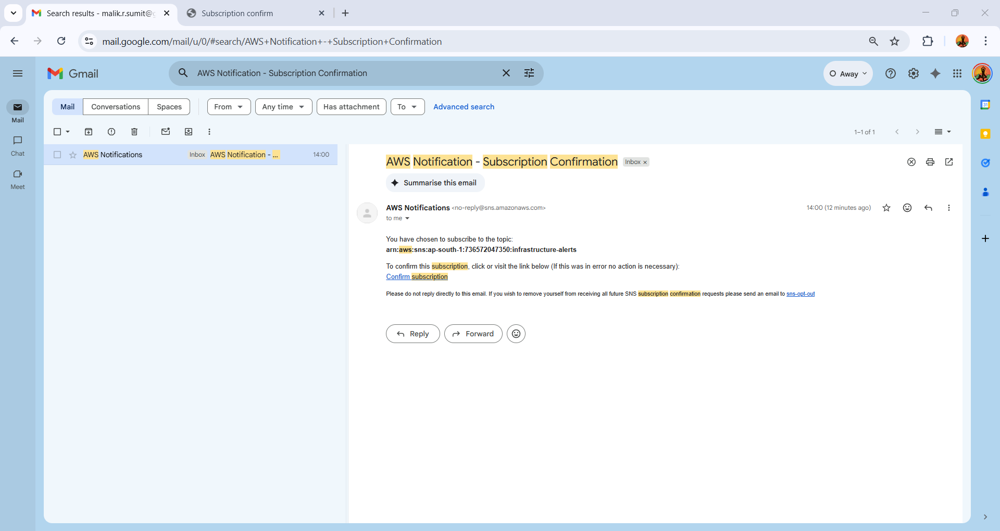
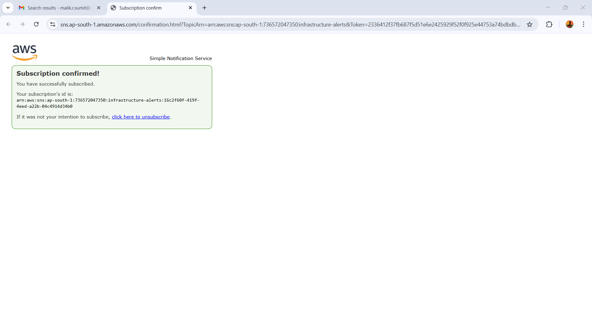

## Project 3: Enterprise Observability & Proactive Alerting

**Goal:** Implement centralized monitoring to detect system failures and notify engineering teams in real-time.

* **Tech Stack:** CloudWatch Agent, SNS, CloudWatch Alarms.

* **Key Features:**
* **Custom Metrics:** Configured the CloudWatch Agent to capture OS-level memory and disk utilization.

* **Log Centralization:** Streamed Apache access and error logs to CloudWatch Log Groups for audit-readiness.

* **Proactive Alerting:** Configured SNS email notifications triggered by CPU utilization breaching the 70% threshold.

* **Validation:**
* Verified log streams in CloudWatch console.

* Stress-tested CPU to trigger and verify SNS email delivery.

---

## Prerequisites

* AWS CLI configured with appropriate IAM permissions.

* Terraform installed.

* Basic understanding of Python for Lambda logic.

---

### Sample Output:

* **SNS Topic & Subscription (The Communication Channel):**

* **CloudWatch Alarm State (The Trigger):**

* **Alarm Graph & Conditions (The Threshold):**

* **SNS Subscription Confirmation Email (Validation):**

---